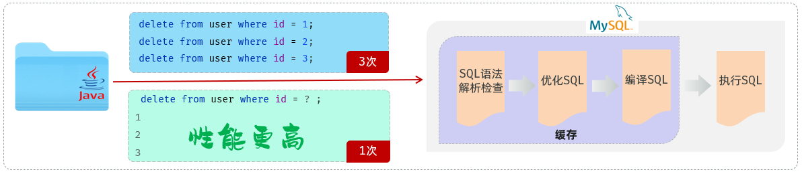

## 基于Java程序操作数据库
JDBC是使用JAVA语言操作关系型数据库的一套API。

---

其他高级框架：
1. MyBatis 
2. MyBatis-Plus
3. Hibernate
4. Spring Data JPA

这些框架底层都是基于JDBC进行封装的。

--- 

#### 关系型数据库有哪些？
1. MySQL
2. Oracle
3. SQL Server

#### JDBC-入门程序
- 需求：基于JDBC程序，执行update语句 （update user set age = 18 where id = 1）
- 步骤：
  - 准备工作：创建一个maven项目，引入依赖；并准备数据库表user
  ```xml
    <dependency>
      <groupId>com.mysql</groupId>
      <artifactId>mysql-connector-j</artifactId>
      <version>8.0.33</version>
    </dependency>
    ```
  - 代码实现：编写JDBC程序，操作数据库
    ```java
    // 1. 注册驱动
    Class.forName("com.mysql.cj.jdbc.Driver");
    // 2. 获取连接
    String url = "jdbc:mysql://localhost:3306/test";
    String user = "root";
    String password = "root";
    Connection connection = DriverManager.getConnection(url, user, password);
    // 3. 获取执行sql语句对象
    Statement statement = connection.createStatement();
    // 4. 执行sql语句
    int i = statement.executeUpdate("update user set age = 18 where id = 1");
    // 5. 释放资源
    statement.close();
    connection.close();
    ```
  - 创建一个数据库 web，并在该数据库中创建user表
    ```sql
    create table user(
    id int unsigned primary key auto_increment comment 'ID,主键',
    username varchar(20) comment '用户名',
    password varchar(32) comment '密码',
    name varchar(10) comment '姓名',
    age tinyint unsigned comment '年龄'
    ) comment '用户表';
  
    insert into user(id, username, password, name, age) values (1, 'daqiao', '123456', '大乔', 22),
                                                               (2, 'xiaoqiao', '123456', '小乔', 18),
                                                               (3, 'diaochan', '123456', '貂蝉', 24),
                                                               (4, 'lvbu', '123456', '吕布', 28),
                                                               (5, 'zhaoyun', '12345678', '赵云', 27);
    ```
#### JDBC-查询数据
- 需求：基于JDBC执行如下select语句，将查询结果封装到User对象中。(AI辅助)
- SQL：`select * from user where username = 'daqiao' and password = '123456'`
- ResultSet(结果集对象)：ResultSet rs = statement.executeQuery()
  - next(): 将光标从当前位置向前移动一行，并判断当前行是否为有效行，返回值为boolean;
    - true: 有效行，当前行有数据
    - false：无效行，当前行没有数据
  - getXxx(...): 获取数据，可以根据列的编号获取，也可以根据列名获取（推荐）


- 结果解析步骤：
  ```java
  while (rs.next()) {
    int id = rs.getInt(1);
  
    // ...省略
  }
  ```

- 例子：
  ```java
  //  User.java
  package com.nineshadow.pojo;

  import lombok.AllArgsConstructor;
  import lombok.Data;
  import lombok.NoArgsConstructor;
  
  @Data
  @AllArgsConstructor
  @NoArgsConstructor
  public class User {
    private Integer id;
    private String username;
    private String password;
    private String name;
    private Integer age;
  }
  ```
  ```java
  //  JDBCTest.java
  @Test
    public void testSelect(){
        String URL = "jdbc:mysql://localhost:3306/web01";
        String USER = "root";
        String PASSWORD = "123456";

        Connection connection = null;
        PreparedStatement statement = null;
        ResultSet resultSet = null; // 封装查询返回的结果

        try {
            // 1. 注册 JDBC 驱动
            Class.forName("com.mysql.cj.jdbc.Driver");

            // 2. 打开链接
            System.out.println("连接数据库...");
            connection = DriverManager.getConnection(URL, USER, PASSWORD);

            // 3. 执行查询
            String sql = "select id,username,password,name,age from user where username = ? AND password = ?"; // 预编译 SQL
            statement = connection.prepareStatement(sql);
            statement.setString(1, "daqiao");
            statement.setString(2, "123456");

            resultSet = statement.executeQuery();

            // 4. 处理结果集
            while (resultSet.next()) {
                User user = new User(
                        resultSet.getInt("id"),
                        resultSet.getString("username"),
                        resultSet.getString("password"),
                        resultSet.getString("name"),
                        resultSet.getInt("age")
                );
                System.out.println(user); // 使用 Lombok 的 @Data 自动生成的 toString() 方法
            }
        } catch (SQLException se) {
            // Handle errors for JDBC
            se.printStackTrace();
        } catch (Exception e) {
            // Handle errors for Class.forName
            e.printStackTrace();
        } finally {
            // 5. 关闭资源
            try {
                if (resultSet != null) resultSet.close();
                if(statement != null) statement.close();
                if(connection != null) connection.close();
            } catch(SQLException se){
                se.printStackTrace();
            }
        }
    }
  ```
- 小结：
  - 1.JDBC程序执行DML语句？DQL语句？
    - DML：int rowsAffected = statement.executeUpdate();
    - DQL：ResultSet rs = statement.executeQuery();
  - 2.DQL语句执行完毕结果集ResultSet解析？
    - resultSet.next(): 判断当前行是否有效
    - resultSet.getXxx(...): 获取数据
--- 
#### 预编译SQL
其实我们在编写SQL语句的时候，有两种风格：
- 1.静态SQL(参数硬编码)
  ```java
    Statement statement = connection.createStatement();
    int i = statement.executeUpdate("update user set age = 18 where id = 1"); // 18 1 直接硬编码
  ```
  这种呢，就是参数值，直接拼接在SQL语句中，参数值是写死的。


- 2.预编译SQL(参数动态传递)
  ```java
  PreparedStatement pstmt = connection.prepareStatement("update user set age = ? where id = ?"); // ? ? 占位
  pstmt.setString(1, 'daqiao'); // 为?占位符赋值
  pstmt.setString(2, '123456'); // 为?占位符赋值
  ResultSet resultSet = pstmt.executeQuery();
  ```
  这种呢，并未将参数值在SQL语句中写死，而是使用 ？ 进行占位，然后再指定每一个占位符对应的值是多少，而最终在执行SQL语句的时候，程序会将SQL语句（SELECT * FROM user WHERE username = ? AND password = ?），以及参数值（"daqiao", "123456"）都发送给数据库，然后在执行的时候，会使用参数值，将？占位符替换掉。

那这种预编译的SQL，也是在项目开发中推荐使用的SQL语句。主要的作用有两个：
- 防止SQL注入，更安全
- 执行效率更高

介绍：
- SQL注入
  - SQL注入：通过控制输入来修改事先定义好的SQL语句，以达到执行代码对服务器进行**攻击**的方法。
  - SQL注入最典型的场景，就是用户登录功能。
    ```sql
      select count(*) from emp where username = 'admin' and password = '123456';
    ```
    通过*控制表单输入*，来修改事先定义好的SQL语句的含义。 从而来攻击服务器。
    ```text
      账号任意：zhangsan
      密码：' or '1'='1;
      SQL注入攻击：select count(*) from emp where username = 'zhangsan' and password = '' or '1'='1';
      登录成功
    ```
    原因：编写的SQL语句是基于字符串进行拼接的。or 连接的条件，是或的关系，两者满足其一就可以。所以，虽然用户名密码输入错误，也是可以查询返回结果的，而只要查询到了数据，就说明用户名和密码是正确的。
- SQL注入解决
  - 通过预编译SQL（`select * from user where username = ? and password = ?`），就可以直接解决上述SQL注入的问题。
  - 注意：在以后的项目开发中，使用的基本全部都是预编译SQL语句。
- 性能更高
   