### 什么是Mybatis?
MyBatis 是一款优秀的 **持久层** 框架，用于 **简化JDBC** 的开发。
- 持久层：指的是就是数据访问层(dao)，是用来操作数据库的。
- 框架：是一个半成品软件，是一套可重用的、通用的、软件基础代码模型。在框架的基础上进行软件开发更加高效、规范、通用、可拓展。
--- 
#### 什么是持久层？
web程序分为三层架构：

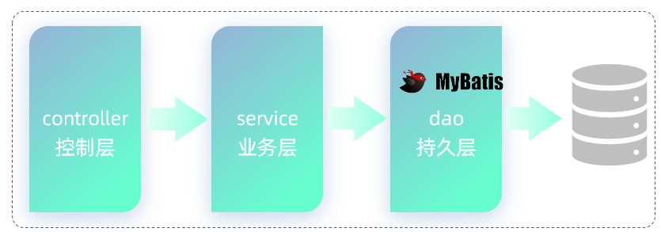

- controller：数据访问层，负责接收请求，响应数据
- service：业务逻辑层，负责处理业务逻辑
- dao：数据访问层，负责操作数据库，处理数据的增删改查

#### 如何简化JDBC？
通过Mybatis就可以大大简化原生的JDBC程序的代码编写，比如 通过 select * from user 查询所有的用户数据，通过JDBC程序操作呢，需要大量的代码实现，而如果通过Mybatis实现相同的功能，只需要简单的三四行就可以搞定。

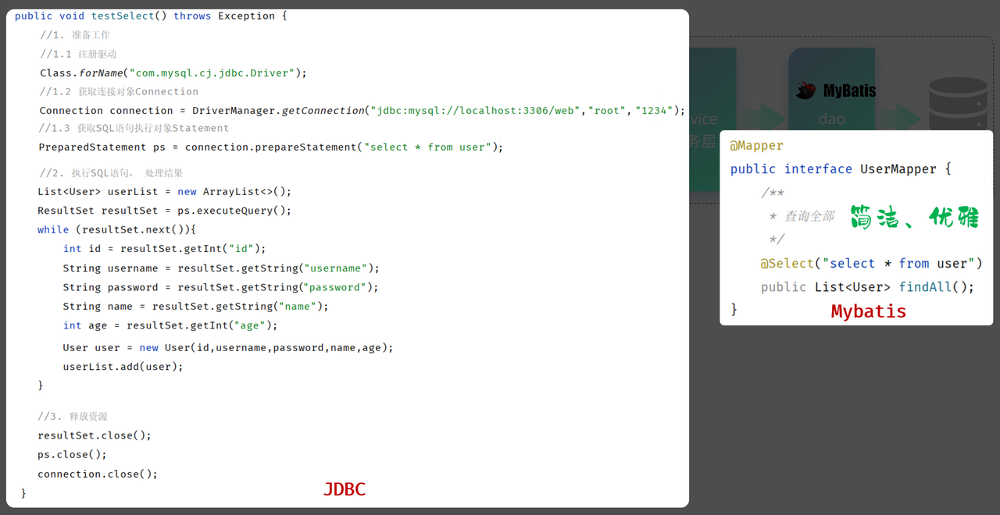

---
### 快速入门
需求：使用Mybatis查询所有用户数据。
#### 使用Mybatis查询所有用户数据
- 准备工作：
  - 1.创建SpringBoot工程，引入Mybatis相关依赖
  - 2.准备数据库表user、实体类User
  - 3.配置Mybatis(在application.properties中配置数据库连接信息)
- 编写Mybatis程序：编写Mybatis的持久层接口，定义SQL（注解/XML）

#### 例子
1. 创建springboot工程，并导入 mybatis的起步依赖、mysql的驱动包、lombok。
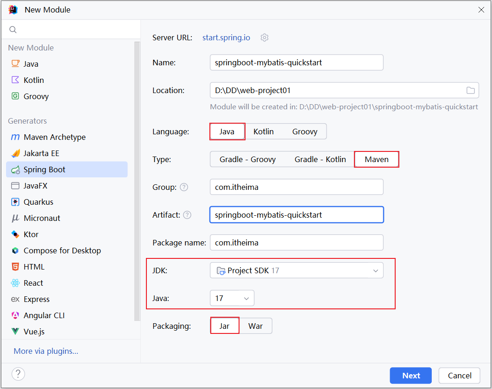
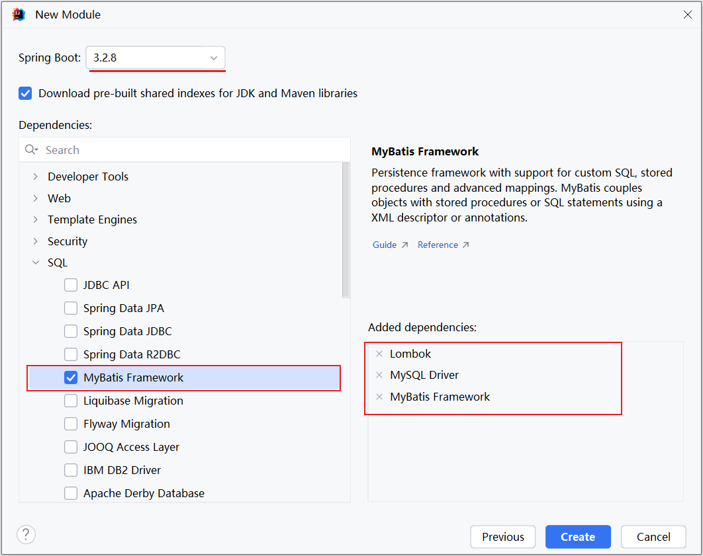
   项目工程创建完成后，自动在pom.xml文件中，导入Mybatis依赖和MySQL驱动依赖。
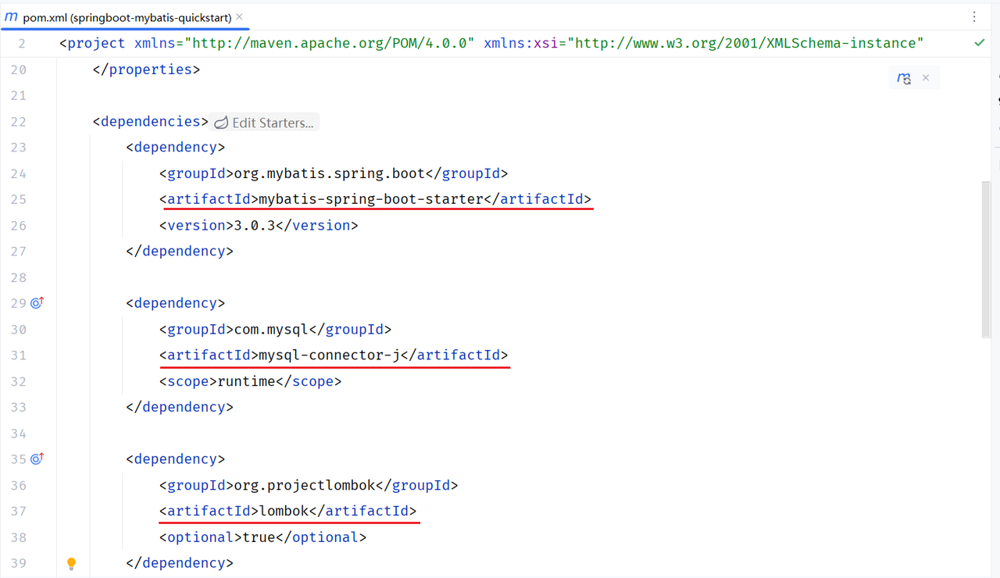
   
2. 数据准备：创建用户表user，并创建对应的实体类User。
   - 用户表 user
     ```sql
      create table user(
      id int unsigned primary key auto_increment comment 'ID,主键',
      username varchar(20) comment '用户名',
      password varchar(32) comment '密码',
      name varchar(10) comment '姓名',
      age tinyint unsigned comment '年龄'
      ) comment '用户表';
    
      insert into user(id, username, password, name, age) values (1, 'daqiao', '123456', '大乔', 22),
                                                                 (2, 'xiaoqiao', '123456', '小乔', 18),
                                                                 (3, 'diaochan', '123456', '貂蝉', 24),
                                                                 (4, 'lvbu', '123456', '吕布', 28),
                                                                 (5, 'zhaoyun', '12345678', '赵云', 27);
     ```
    - 实体类：实体类的属性名与表中的字段名一一对应。 实体类放在 com.example.pojo 包下 user。
     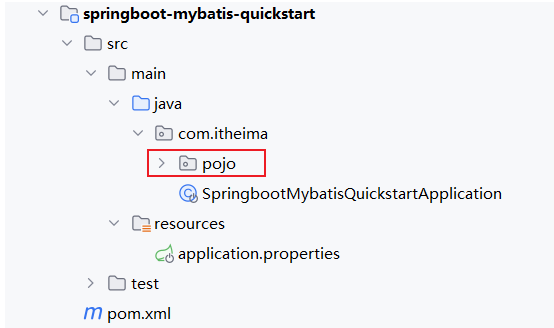
     ```java
     // java/com.example.pojo.User
     @Data
     @NoArgsConstructor
     @AllArgsConstructor
     public class User {
       private Integer id; //ID
       private String username; //用户名
       private String password; //密码
       private String name; //姓名
       private Integer age; //年龄
     }
     ```
3. 配置Mybatis

   在 application.properties 中配置数据库的连接信息。
   ```properties
    #数据库访问的url地址
    spring.datasource.url=jdbc:mysql://localhost:3306/web
    #数据库驱动类类名
    spring.datasource.driver-class-name=com.mysql.cj.jdbc.Driver
    #访问数据库-用户名
    spring.datasource.username=root
    #访问数据库-密码
    spring.datasource.password=root@1234
    ```
4. 编写Mybatis程序：编写Mybatis的持久层接口，定义SQL语句（注解）

   在引导类所在包下，在创建一个包 `mapper` 。在 `mapper` 包下创建一个接口 `UserMapper` ，这是一个持久层接口（Mybatis的持久层接口规范一般都叫 XxxMapper）。
   ```java 
    // java/com.example.mapper.UserMapper
    import com.itheima.pojo.User;
    import org.apache.ibatis.annotations.Mapper;
    import org.apache.ibatis.annotations.Select;
    import java.util.List;
    
    @Mapper
    public interface UserMapper {
        /**
         * 查询全部
         */
        // @Select 查询
        // @Insert 新增
        // @Update 修改
        // @Delete 删除
        @Select("select * from user")
        public List<User> findAll();
    }
   ```
---
#### 辅助配置
- 配置SQL提示
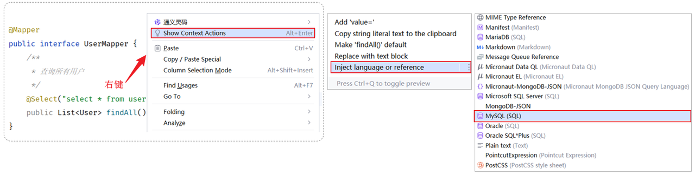
配置完成之后，发现SQL语句中的关键字有提示了，但还存在不识别表名(列名)的情况：
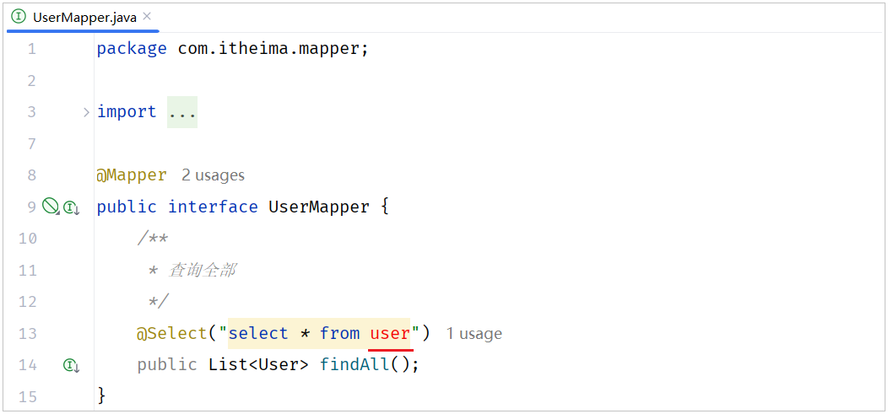
 - 产生原因：Idea和数据库没有建立连接，不识别表信息
 - 解决方案：在Idea中配置MySQL数据库连接

  按照如下方如下方式，来配置当前IDEA关联的MySQL数据库（必须要指定连接的是哪个数据库）。
 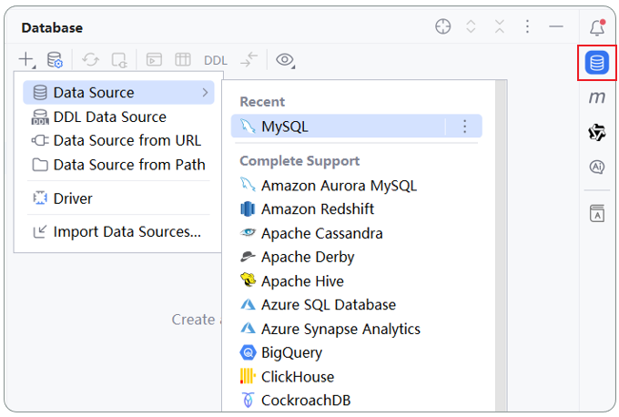
 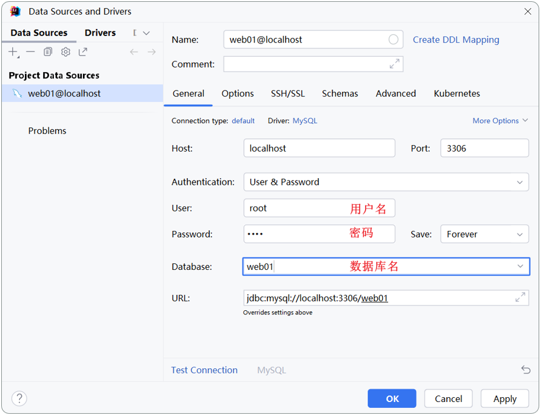
 tips: 该配置的目的，仅仅是为了在编写SQL语句时，有语法提示（写错了会报错），不会影响运行，即使不配置也是可以的
 
- 配置Mybatis日志输出

  默认情况下，在Mybatis中，SQL语句执行时，我们并看不到SQL语句的执行日志。 在`application.properties`加入如下配置，即可查看日志： 
  ```properties
    #mybatis的配置
    mybatis.configuration.log-impl=org.apache.ibatis.logging.stdout.StdOutImpl
  ```
--- 
#### JDBC VS Mybatis
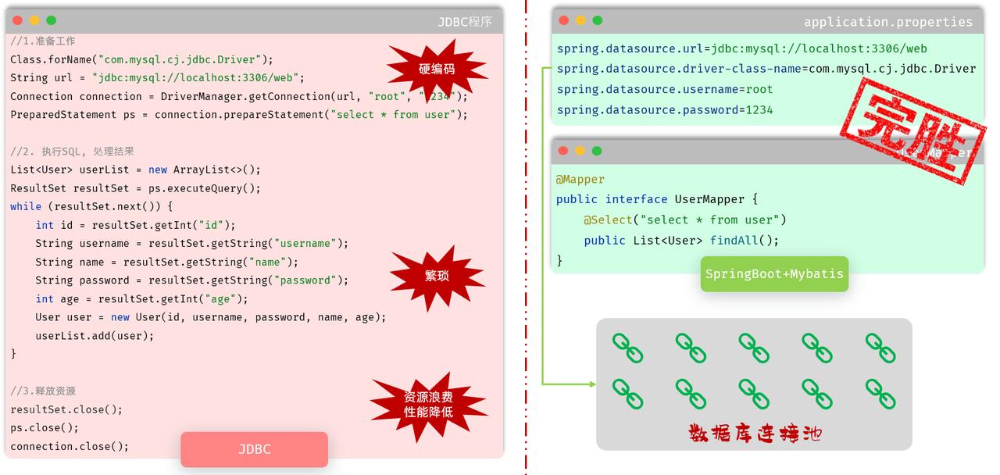
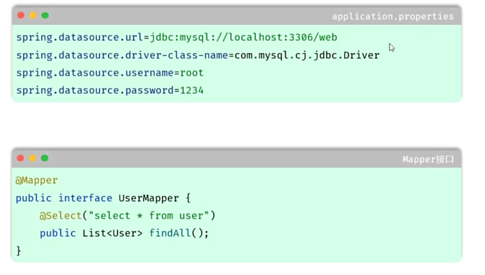

#### 以上的数据库连接池是什么？
- 数据库连接池是个容器，负责分配、管理数据库连接（Connection)
- 他允许应用程序重复使用一个现有的数据库连接，而不是再重新创建一个。
- 释放空闲时间超过最大空闲时间的连接，来避免因为没有释放连接而引起的数据库连接遗漏
1. 没有数据库连接池的情况
  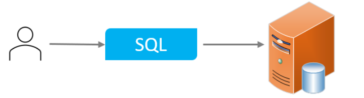
   每次执行SQL时都需要创建连接、销毁链接
2. 有数据库连接池的情况
   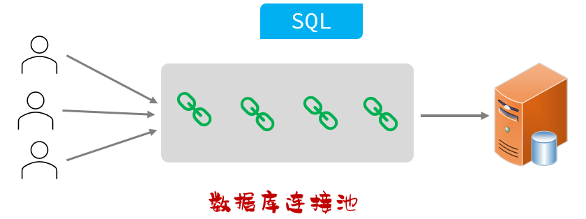
   - 程序在启动时，会在数据库连接池(容器)中，创建一定数量的Connection对象
   - 客户端在执行SQL时，先从连接池中获取一个Connection对象，然后在执行SQL语句，SQL语句执行完之后，释放Connection时就会把Connection对象归还给连接池（Connection对象可以复用）
   - 客户端获取到Connection对象了，但是Connection对象并没有去访问数据库(处于空闲)，数据库连接池发现Connection对象的空闲时间 > 连接池中预设的最大空闲时间，此时数据库连接池就会自动释放掉这个连接对象

数据库连接池的好处：
- 资源重用
- 提升系统响应速度
- 避免数据库连接遗漏

#### 要怎么样实现数据库连接池呢？
- 标准接口：DataSource
  - 官方（sun）提供的数据库连接池接口，由第三方组织实现此接口。
  - 功能：获取链接 `Connection getConnection() throws SQLException;`
  
- 不需要自己去实现，市面上比较优秀的数据库连接池产品：
  - C3P0 (比较老，现在用的少)
  - DBCP (比较老，现在用的少)
  - Druid (现在用的多,阿里巴巴开源的)
  - HikariCP（现在用的多,springBoot默认）

- 如何切换数据库连接池？
  1. 在`pom.xml`文件中引入依赖
  ```xml
   <dependency>
     <!-- Druid连接池依赖 -->
     <groupId>com.alibaba</groupId>
     <artifactId>druid-spring-boot-starter</artifactId>
     <version>1.2.19</version>
   </dependency>
  ```
  2. 在`application.properties`中引入数据库连接配置
  ```properties
    spring.datasource.type=com.alibaba.druid.pool.DruidDataSource
    spring.datasource.druid.driver-class-name=com.mysql.cj.jdbc.Driver
    spring.datasource.druid.url=jdbc:mysql://localhost:3306/web
    spring.datasource.druid.username=root
    spring.datasource.druid.password=1234
  ```
  3. 配置完毕之后，我们再次运行单元测试，看控制台输出的日志中，是否将连接池切换为了 Druid连接池。
  
  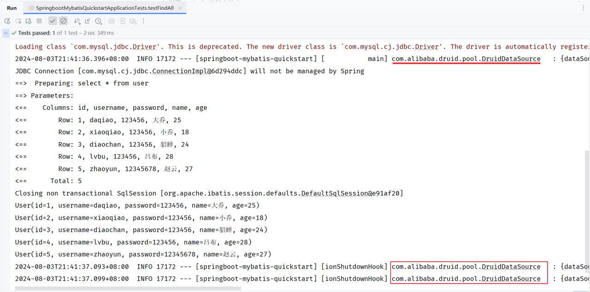

---
### Mybatis的增删改查
- 删除
- 新增
- 更新
- 查询
---
### Mybatis的XML映射配置
介绍XML映射配置

---